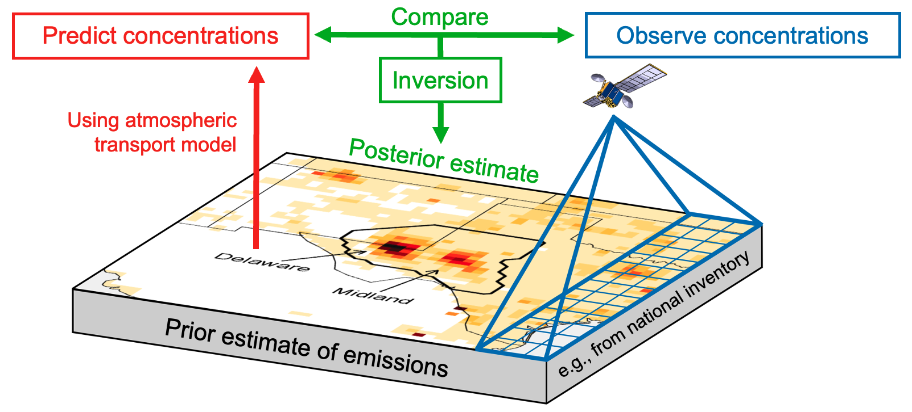
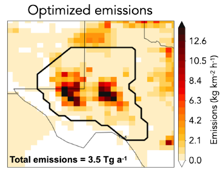
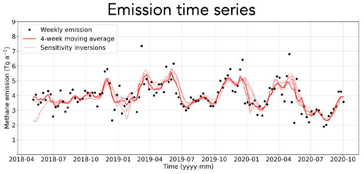

The Integrated Methane Inversion (IMI) is a user-friendly research-grade cloud-computing tool for <strong>estimating total methane emissions for any domain and period of interest</strong> by analytical inversion of satellite observations from the TROPOspheric Monitoring Instrument (TROPOMI). It enables researchers and stakeholders to <strong>infer methane emissions at up to 0.125° × 0.15625° (≈ 12 × 12 km²) spatial resolution</strong> and up to weekly temporal resolution from <a href="https://registry.opendata.aws/sentinel5p/">TROPOMI satellite data resident on the Amazon Web Services (AWS) cloud</a>, without requiring
expert knowledge of inverse methods or cumbersome data download. 
 
 
The IMI uses the <a href="https://geos-chem.org">GEOS-Chem 3-D chemical transport model</a> driven by NASA Goddard Earth Observing System (GEOS) meteorological data as a forward model for the inversion. It uses <strong>cutting-edge algorithms developed by the <a href="https://carboninversion.com/people/">IMI team</a></strong> and is documented extensively in peer-reviewed research literature. The IMI is <strong>strongly documented and fully open-source to ensure transparency, reproducibility, and integrity of the results.</strong>
 
 
An IMI preview feature allows the users to display the satellite observations for their domain and period of interest along with prior emission inventories, point source data, and expected information to be achieved from the inversion.

	<a href="{{ site.baseurl }}#topTwoColumn">
		<button id="access-btn">Learn How to Access</button>
    </a>

<a href="https://integralearth.github.io">Integral Earth</a>, a simple web interface, allows non-experts to access the IMI with no learning curve. Users can request inversions with review by the IMI team and view inversion results through interactive visualizations.

		

		 &nbsp;&nbsp;&nbsp;
		

