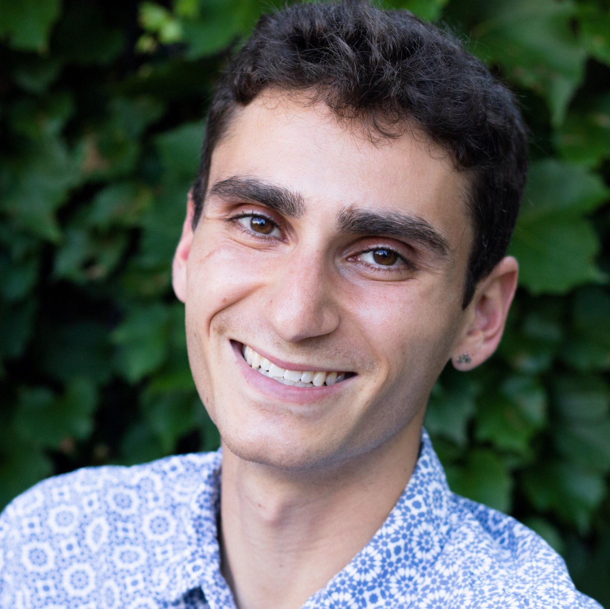
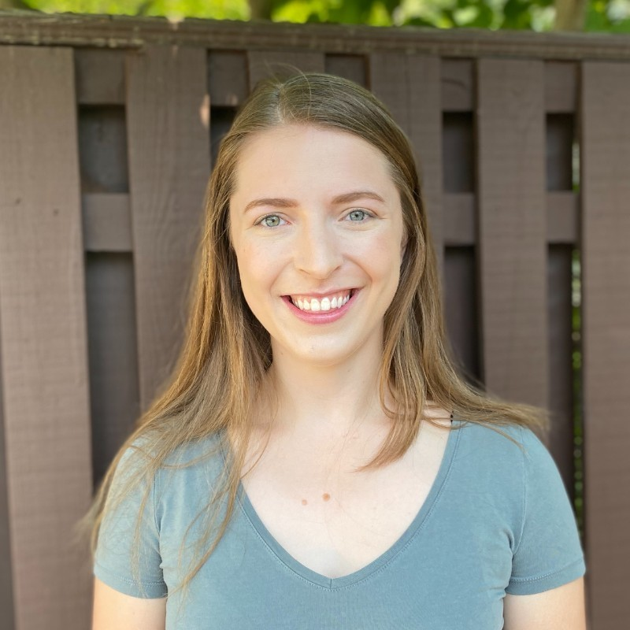

<h2 style="text-align: center">IMI Steering Committee</h2>

    

        
        
Daniel Varon

        
IMI Scientist, MIT

        

            
            
            

            
        

    

    

        
        
Daniel Jacob

        
IMI Co-Scientist, Harvard

        

            
            
        

    

    

        
        
Lucas Estrada

        
IMI Lead Developer, Harvard

        

            
            
            
            
        

    

    

        
        
Melissa Sulprizio

        
IMI Software Engineer, Harvard

        

            
            
            
            
        

    

    

        
        
John Thomas

        
<a href = "https://integralearth.github.io/" target = "#" style = "color: inherit;">Integral Earth</a> Lead Developer

        

            
            
            
            
        

    

    

        
        
Ilse Aben

        
Collaborator, SRON

        

            
            
        

    

    

        
        
Bram Maasakkers

        
Collaborator, SRON

        

            
            
        

    

    

    	
        
Sabour Baray

        
Collaborator, ECCC

        

            
            
            
        

    

    

    	
        
Hannah Nesser

        
Collaborator, NASA JPL

        

            
            
        	
            
        

    

    

        
        
Zichong Cheng

        
Collaborator, HKUST

        

            
            
            
        

    

    

        
        
Lee Murray

        
Collaborator, U. Rochester

        

            
            
            
            
        

    
