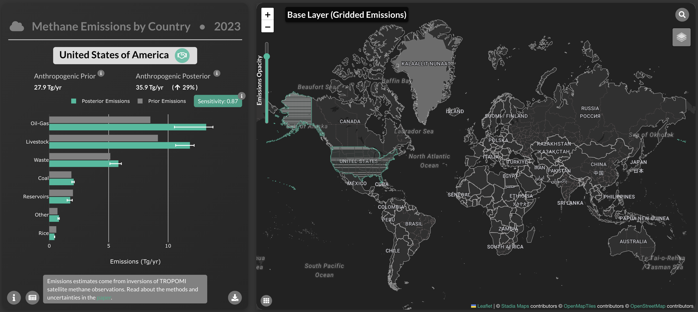
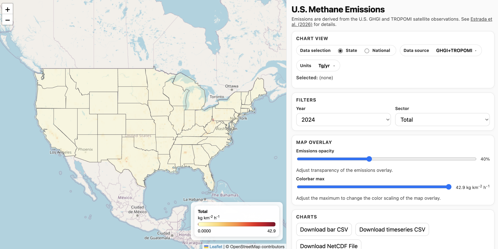

<h1>Tools</h1>

<h2>Worldwide Methane Emissions for 2023</h2>

<a href="http://doi.org/10.1038/s41467-025-67122-8" target="_">East et al. (2025)</a> utilized the IMI to create <a href="https://worldwidemethaneemissions.com/" target="_">https://worldwidemethaneemissions.com/</a>, an interactive website where results for individual countries can be queried, including emissions and the information content.

	

<h2>Annual CONUS Methane Emissions for 2019-2024</h2>

<a href="https://egusphere.copernicus.org/preprints/2026/egusphere-2026-655/" target="_">Estrada et al. (2026)</a> have generated a <a href="https://laestrada.github.io/conus_emissions_viz/" target="_">custom dashboard</a> for visualizing annual IMI results over the CONUS for 2019-2024.

	

